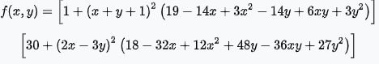

# STEP 24 복잡한 함수의 미분
* [최적화 문제에 사용되는 벤치마크 함수 목록](https://en.wikipedia.org/wiki/Test_functions_for_optimization)
  * 
## 24.1 Sphere 함수
* Sphere 함수
  * z = x^2 + y^2
``` 
import numpy as np
from dezero import Variable

def sphere(x, y):
    z = x ** 2 + y ** 2
    return z

x = Variable(np.array(1.0))
y = Variable(np.array(1.0))
z = sphere(x, y)
z.backward()
print(x.grad, y.grad)  # 2.0 2.0
```
## 24.2 matyas 함수
* matyas 함수
  * z = 0.26(x^2 + y^2) - 0.48xy
``` 
def matyas(x, y):
    z = 0.26 * (x ** 2 + y ** 2) - 0.48 * x * y
    return z

def matyas_poor(x, y):
    z = sub(mul(0.26, add(pow(x,2), pow(y,2))), mul(0.48, mul(x,y)))
    return z

x = Variable(np.array(1.0))
y = Variable(np.array(1.0))
z = matyas(x, y)
z.backward()
print(x.grad, y.grad) # 0.04.. 0.04..
```
## 24.3 Goldstein-Price 함수
* Goldstein-Price 함수
  * 
``` 
def goldstein(x, y):
    z = (1 + (x + y + 1)**2 * (19-14*x+3*x**2 - 14*y +  6*x*y + 3*y**2)) \
        * (30 + (2*x - 3*y)**2 * (18 - 32*x + 12*x**2 + 48*y - 36*x*y + 27*y**2))
    return z

x = Variable(np.array(1.0))
y = Variable(np.array(1.0))
z = goldstein(x, y)
z.backward()
print(x.grad, y.grad)  # -5376.0 8064.0 
```
* 칼럼 - 정적 계산 그래프와 동적 계산 그래프
  * 